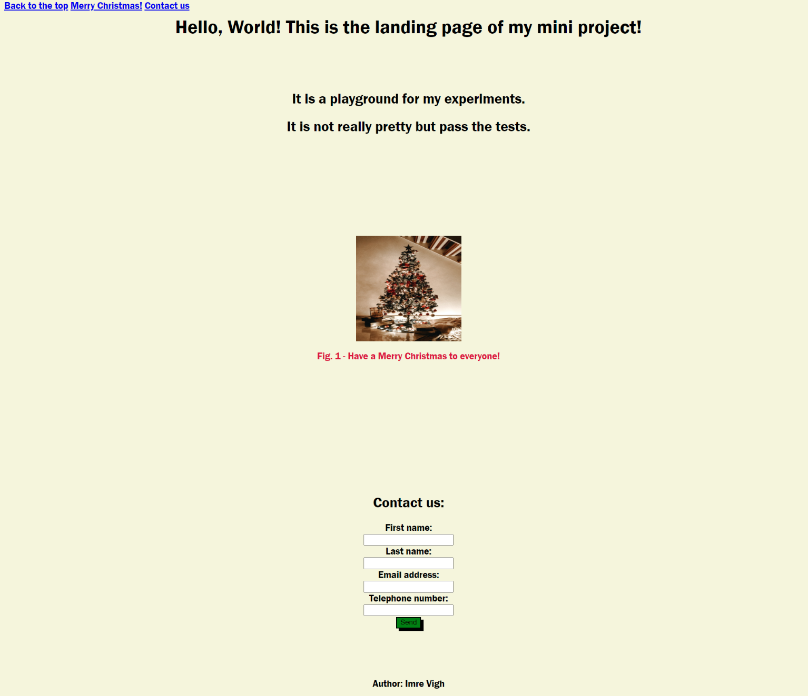

# Mini-Project: Landing Page

## Description

A landing page built by a group of web developers using HTML and CSS to collect visitor's contact information.

### User Story

As a client, I want to view a single webpage to have an image with a caption, a header and footer, a polished and accessible UI and a contact form that SO THAT it collects a visitor's contact information.

### Acceptance Criteria

This can be achieved by completing the following:

* The page uses semantic HTML elements.

* The page uses universal, element, and class selectors in CSS.

* The page features at least three colors in the design.

* The page uses a single font and font family for all text.

* The page uses at least two heading elements (`<h1>` through `<h6>`).

* The header is fixed to the top of the page on scroll.

* The header contains a navigation bar with three links that display inline, including a contact link.

* If the contact link is clicked, the page jumps directly to the contact form.

* The contact form includes `input` elements for name and email.

* The contact form includes a Send button.

* The image includes a descriptive `alt` attribute.

* The page is deployed to GitHub Pages.

### Usage
To use this Landing Page you don't need any special tools. Just open the webpage from Github Pages and you will be able to see how the fixed navigation bar works and how to implement a contact form into your webpage.

### Mock up

The following image shows the web application's appearance and functionality:

